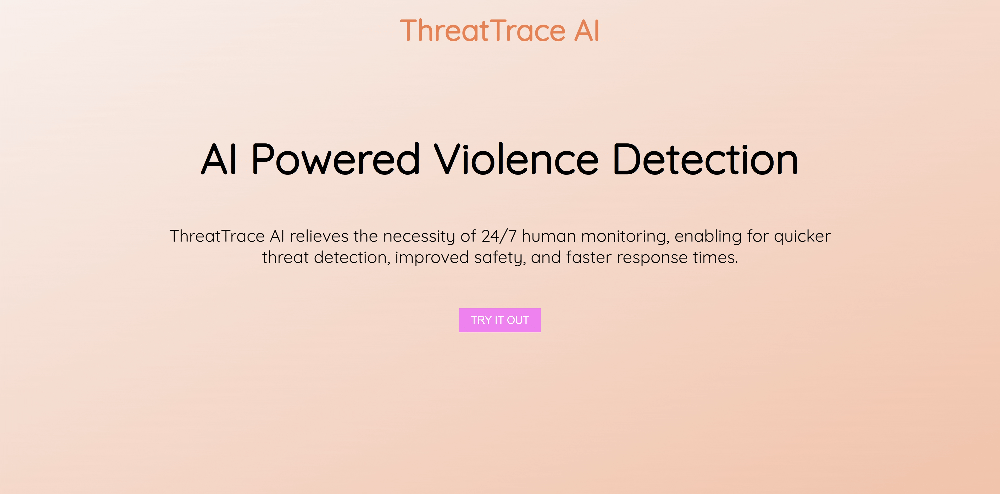

# ThreatTrace AI: Your Solution for Swift Violence Detection

ThreatTrace AI eliminates the need for constant human monitoring of camera footage, facilitating faster threat identification and enhanced safety.

Explore our [Devpost submission](https://devpost.com/software/threattrace-ai) for more details.

## Inspiration

In response to the rising weapon-related crimes in Toronto, we developed a weapon detection tool using artificial intelligence to reduce the potential for violence.

## What It Does

ThreatTrace AI is a peacekeeping platform aiming to utilize AI object detection to identify weapons and alert the authorities regarding potential threats and violence. Our ultimate vision was to monitor real-time security footage for violence detection, eliminating the need for human oversight across multiple screens. However, due to time constraints, we focused on training our machine learning model solely to detect weapons, namely pistols and guns from images.

## How We Built It

Our frontend utilizes Python's Flask library with HTML and CSS, while the backend is powered by TensorFlow and various other libraries and repositories. We trained our machine learning model with a specific dataset and organized selected images in a folder, which we iterate through to create a 'slideshow' on the frontend.

## Challenges We Ran Into

Throughout the event, we encountered numerous challenges that shaped the course of our inspiration development as a team. We started off as two separate groups of three people, but then one person from one team fell ill on the day of the event, and the other team was looking to form a team of four. However, since there were many teams of two or three looking for more members, one team had to disassemble into a group of two and join another group of two to finally form a group of four.

During our setup phase, our computers ran into a lot of troubles while trying to install the necessary packages for the machine learning model to function. Our original goal was to have three to all four of us train the learning model with datasets, but unfortunately, we spent half of the time, and only two members managed to set up the machine learning model by the end of the event. In the end, only one member managed to train the model, making this the greatest technical challenge we've encountered in the event and slowing our progress by a margin.

## Accomplishments That We're Proud Of

We're proud of the progress made from utilizing machine learning APIs such as TensorFlow and object detection for the very first time. Additionally, two members had no experience with Flask, and yet we were still able to develop a functional frontend in conjunction with HTML and CSS.

## What We Learned

We have learned about numerous new technical knowledge regarding libraries, packages, and technologies such as TensorFlow, virtual environments, GitHub, CocoAPI, and ObjectDetectionAPI. Since three of our members use Windows as the main operating system, we had to utilize both the Windows and the bash terminals to set up our repository. Through our numerous trials, we have also learned about the vast amount of time it takes to train a machine learning model and dataset before being able to make use of it. Finally, the most important lesson we have learned was team collaboration, as each of us has made use of our strengths, and we utilized our abilities well to facilitate this project.

## What's Next for ThreatTrace AI

Our goal is to continue training our learning model to accept more weapons at different lighting levels and angles, so that our dataset can be more refined as time goes. Then we will transition into training video footages with the learning model. Ultimately, we will reach our original vision of a real-time video violence detection AI.
