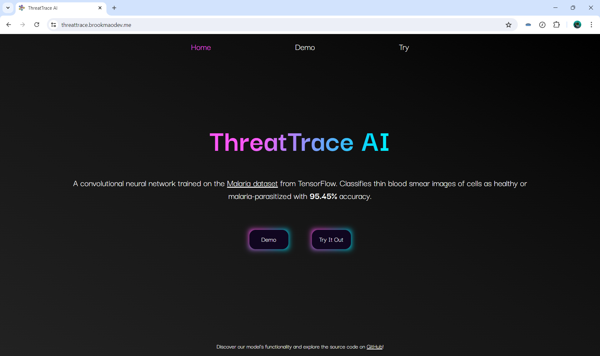
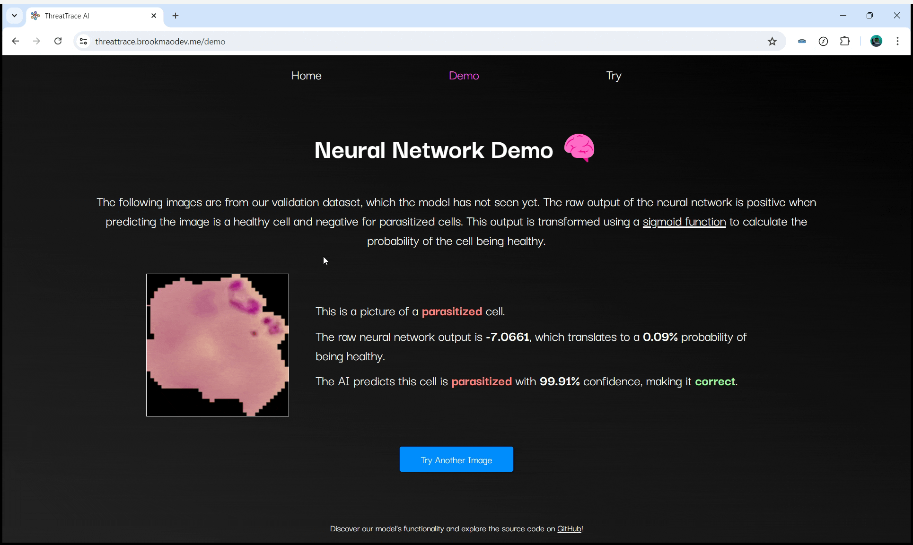
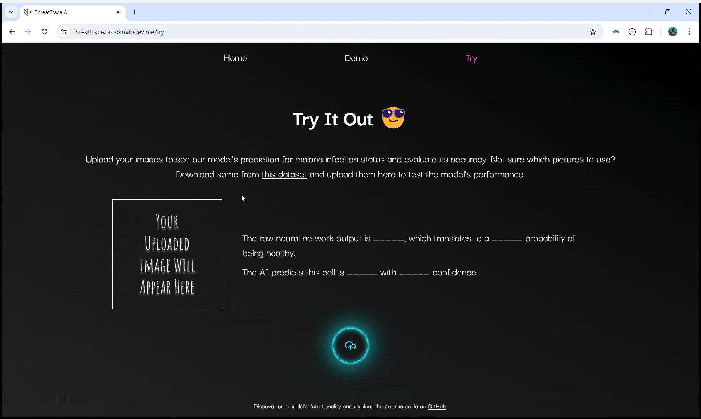

# ThreatTrace AI

ThreatTrace AI is a convolutional neural network trained on the [Malaria dataset from TensorFlow](https://www.tensorflow.org/datasets/catalog/malaria). It classifies thin blood smear images of cells as healthy or malaria-parasitized with **95.45% accuracy**.


_This is the homepage._
[Try it out here!](https://threattrace.brookmaodev.me/)


_The demo page, where the neural network is tested on images from our validation dataset._


_The try page, where users can upload their own images for the neural network to make predictions on._

## How It Works

- **TensorFlow** is used in the `model_builder.ipynb` file to build and train the model using Google Collaboratory.
- The model and its weights were then downloaded and saved in the `model` folder.
- A web app using **Flask** to serve a **HTML**, **CSS**, **Bootstrap**, **JavaScript** frontend was then set up in `app.py` which also served as an API endpoint.
- The app was then containerized using **Docker** and deployed to **Google Cloud Run**.

## How to Build

Follow these steps to build and run ThreatTrace AI locally:

1. Fork the repository by clicking the "Fork" button at the top right of the repository page on GitHub.
2. Clone your forked repository using the following command, replacing `<your-username>` with your GitHub username:
   ```bash
   git clone https://github.com/<your-username>/ThreatTraceAI.git
   ```
3. Install Docker Desktop from [here](https://www.docker.com/products/docker-desktop).
4. Open a terminal in the repository directory and run the following command to build and start the containers:
   ```bash
   docker-compose -f "compose.yml" up -d --build
   ```
5. Open your web browser and go to [http://localhost](http://localhost) to access ThreatTrace AI.

## Image Attributions

- Favicon image used from [Freepik](https://www.freepik.com/icon/neural_2103658#fromView=search&page=1&position=14&uuid=acd1259a-2315-4e6c-9580-88ed0a5d32d6)
